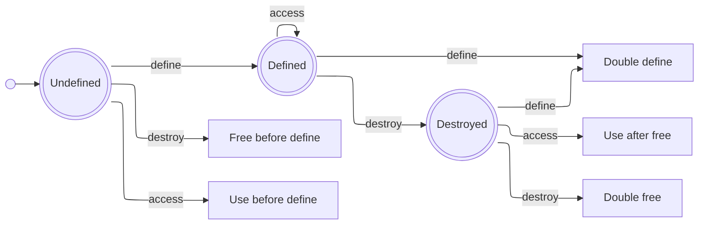

# Design of the Intermediate Representation

This is a static single-assignment (SSA) borrow-checked intermediate representation (IR).
It is intended as a compilation target, on which memory-safety can be checked, before further lowering.
It combines ideas from LLVM IR and Rust MIR.
The interpreter serves as a prototype to validate the language semantics.

The language is deliberately kept close to LLVM IR, so that lowering is easy.
The ownership and borrowing model is greatly simplified compared to that of Rust MIR.
Certain language features are omitted entirely, to simplify the semantics and reduce the need for annotations.
Whether or not this IR is an acceptable compromise in practice, is an open question.

The following sections outline:
- problem and motivation
- the design of the IR
- the current project state and future work
- sources and resources for further reading

## Motivation
<!-- What problem am I trying to solve? -->
<!-- Which other solutions and projects exist? -->
- memory-safe programs
- no garbage-collection overhead
- deterministic runtime for real-time applications
- make simplified borrow-checking more accessible for other language designers

## Design
<!-- What design decisions and trade-offs were made, and why? -->
<!-- What is the language? -->
<!-- How are references modelled? -->
<!-- How are aggregate types modelled? -->
<!-- -->
<!-- -->

### ?. Static Single-Assignment
- variables are immutable, easy to reason about and optimize

### ?. Move Semantics and In-Place Update
- `move`
- `update`

### ?. References are Baked-In
- `ref` and `deref`
- cheaper than copying for aggregate types
- lifetime of a reference must be explicitly checked against its target
- escaping vs. non-escaping references allow aggressive optimization and avoid lifetime annotations

### ?. Deep Copy
- `copy`
- lifetime is disjoint from the original, **no sharing** under any circumstances

### ?. Life-Cycle of a Variable

At a given source-location, a variable can be in one of several valid states:

1. undefined
2. defined
3. destroyed (dropped, moved, or updated)

It could also be in one of the following error states:

- use-before-define
- free-before-define
- double-define
- use-after-free
- double-free

The diagram below illustrates the life-cycle of a variable, with the valid and error states:

Note that stack-allocated variables are automatically freed when the stack-frame is popped.
This means there is no need to explicitly free a stack-allocated variable.
A heap-allocated variable *must* be freed explicitly.
This means heap variables are not allowed to be in the 'Defined' state, when the enclosing function returns.
That would be a memory leak.
For the moment, we will focus on stack-allocated memory though.

### ?. Explicit Heap Storage
- `box` which is like the `std::unique_ptr` in C++

### Optional: Scalarized Tuples
- add tuples as a language-level construct
- immutable data and the lack of bit-wise operations makes it easy to _scalarize_ all tuples
- scalarized tuples are good for performance
- allows validating meaningful examples with references

## Current State and Future Work

Done:
- basic arithmetic and logic instructions
- basic control flow instructions
- `copy`
- `move`
- `drop`
- `ref` and `deref` within a block

In progress:
- data-flow analysis for variables

To Do:
- functions consisting of several blocks
- references across function boundaries
- escaping vs. non-escaping references
- `update`
- data-flow analysis for references

Optional:
- scalarized tuples

## Sources and Resources
- 

---
**Copyright (c) 2026 Marco Nikander**
