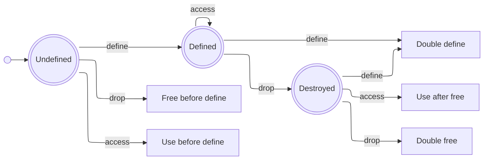

# Design of the Intermediate Representation

This IR is intended as a compilation target, on which borrow-checking can be performed.
Like all IRs, it sits between high-level languages such as C or TypeScript on one end, and Assembly on the other end.
It is based on [three-address code](https://en.wikipedia.org/wiki/Three-address_code) (3AC aka TAC).
The notation uses symbolic expressions, heavily inspired by WebAssembly.
The instructions themselves are inspired by LLVM IR and Rust MIR.

The [instruction set](instructions.md) is deliberately kept small, so that analysis and lowering is easy.
The ownership and borrowing model is greatly simplified compared to that of Rust MIR.
Certain language features are omitted entirely, to simplify the semantics and reduce the need for annotations.

## Motivation
<!-- What problem am I trying to solve? -->
<!-- Which other solutions and projects exist? -->

The goal is to write memory-safe programs
- without garbage-collection overhead
- with deterministic runtime for real-time applications
- without lifetime annotations

## Design
<!-- What design decisions and trade-offs were made, and why? -->
<!-- What is the language? -->
<!-- How are references modelled? -->
<!-- How are aggregate types modelled? -->

There is a table of [design decisions](decisions.md) which outlines many design decisions and the reasoning behind them.
Several important features are:

| Feature                             | Why? |
| :--                                 | :--  |
| immutable data                      | resources are easy to reason about and optimize |
| call-by-value                       | keeps the language implementation relatively simple |
| storage is on the stack, by default  | good runtime performance, lifetimes tied to lexical scope are easy to reason about |
| heap storage is opt-in              | clear semantics, heap storage must be expicitly freed at the end of its lifetime |

## Life-Cycle of a Resource

At a given source-location, a resource can be in one of several valid states:

1. Undefined
2. Defined
3. Destroyed (dropped, moved, or updated)

It could also be in one of the following error states:

- use-before-define
- free-before-define
- double-define
- use-after-free
- double-free

Control flow in the program can also result in the state of a resource becoming:

4. Ambiguous

This means that the resource may be in one of several states.
It is _not_ an error for a resource to _be_ in an ambiguous state, but almost all operations on such a resource will result in an error.
Phi-nodes can disambiguate whether or not the resource is actually live, and assign it to a new resource. 
The `return` of some other resource will free all storage for local resources, including those which are in an ambiguous state.
All other operations are forbidden on resources which are in an ambiguous state.

The diagram below illustrates the life-cycle of a resource, with the valid and error states:

Stack-allocated resources are automatically freed on return, i.e. when the stack-frame is popped.
This means there is no need to explicitly free a stack-allocated resource.
A heap-allocated, i.e. owned, resource *must* be freed explicitly, via `drop`. 

---
**Copyright (c) 2026 Marco Nikander**
