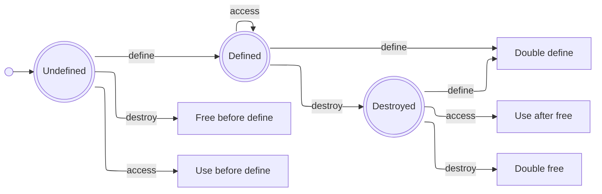

# Design of the Intermediate Representation

This is a static single-assignment (SSA) intermediate representation (IR).
This IR is intended as a compilation target, on which borrow-checking can be performed, before further lowering.
It combines ideas from LLVM IR and Rust MIR.
The interpreter serves as a prototype to validate the language semantics.

The [instruction set](instructions.md) is deliberately kept small and close to LLVM IR, so that lowering is easy.
The ownership and borrowing model is greatly simplified compared to that of Rust MIR.
Certain language features are omitted entirely, to simplify the semantics and reduce the need for annotations.

## Motivation
<!-- What problem am I trying to solve? -->
<!-- Which other solutions and projects exist? -->

The goal is to write:
- memory-safe programs
- without garbage-collection overhead
- with deterministic runtime for real-time applications
- without lifetime annotations

## Design
<!-- What design decisions and trade-offs were made, and why? -->
<!-- What is the language? -->
<!-- How are references modelled? -->
<!-- How are aggregate types modelled? -->

There is a table of [design decisions](decisions.md) which outlines many design decisions and the reasoning behind them.
Several important features are:

| Feature                             | Why? |
| :--                                 | :--  |
| static single-assignment (SSA) form | variables are easy to reason about and optimize |
| call-by-value                       | keeps the language implementation relatively simple |
| storage is on the stack by default  | good runtime performance, lifetimes tied to lexical scope are easy to reason about |
| heap storage, i.e. `box` is explicit| heap storage is vital for persistent data, but must be freed at the end of its lifetime |

## Life-Cycle of a Variable

At a given source-location, a variable can be in one of several valid states:

1. undefined
2. live
3. dead (dropped, moved, or updated)

It could also be in one of the following error states:

- use-before-define
- free-before-define
- double-define
- use-after-free
- double-free

The diagram below illustrates the life-cycle of a variable, with the valid and error states:

Note that stack-allocated variables are automatically freed on return, i.e. when the stack-frame is popped.
This means there is no need to explicitly free a stack-allocated variable.
A heap-allocated variable *must* be freed explicitly.
This means heap variables are not allowed to be in the 'Defined' state, when the enclosing function returns.
That would be a memory leak.

---
**Copyright (c) 2026 Marco Nikander**
